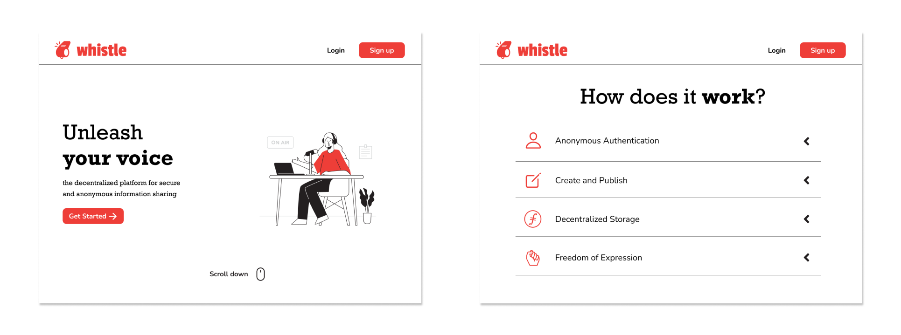

# Whistle

Whistle is a decentralized platform for anonymous whistleblowing, leveraging blockchain technology for secure and censorship-resistant content storage.

> Note: This is a web 3.0 project

## Preview

<h4>Landing</h4>

<h4>Authentication</h4>

<h4>Dashboard & Editor</h4>

## Features

-   **Decentralized Whistleblowing:** Safely publish and share sensitive information without the risk of censorship.

-   **Filecoin Integration:** Leverage Filecoin for decentralized storage, ensuring the permanence and integrity of published content.

-   **Anonymous Authentication:** Users can authenticate and interact with the platform without revealing personal information.

-   **Markdown Editor:** Create and publish content using a user-friendly markdown editor similar to popular note-taking apps.

-   **Browse Latest Articles:** Discover the latest content published by whistleblowers in the community.

## Technologies Used

<!-- prettier-ignore -->
| Technology | Purpose |
|------------|---------|
|  [Next.js](https://nextjs.org/) | React framework for building web applications |
|  [React](https://reactjs.org/) | JavaScript library for building user interfaces |
|  [Tailwind CSS](https://tailwindcss.com/) | Utility-first CSS framework for styling |
|  [NextUI](https://nextui.org/) | UI library for Tailwind CSS with theming support |
|  [MetaMask](https://metamask.io/) | Ethereum wallet for secure and anonymous authentication |
|  [Filecoin](https://filecoin.io/) | Decentralized storage for secure and permanent content |
|  [IPFS](https://ipfs.io/) | InterPlanetary File System for decentralized content addressing |
|  [Markdown](https://www.markdownguide.org/) | Lightweight markup language for formatting content |

## Contribution Guidelines

Feel free to contribute to the development of Whistle! Follow these guidelines:

1. Fork the repository and create a new branch for your feature or bug fix.

2. Make your changes and submit a pull request.

3. Ensure your code follows the coding standards and is well-documented.

## License

This project is licensed under the [MIT License](LICENSE).

## Acknowledgments

-   Thanks to the open-source community for their contributions and support.
-   Special mention to [Filecoin](https://filecoin.io/) for providing decentralized storage.
